# Group Project: Design Journey

**You are encouraged to work ahead on everything on this project.** (Though we suggest you hold back on the interactivity until Project 3.) **Each section is required for a specific milestone. You are required to have these sections completed before that milestone's deadline.**

**Be clear and concise in your writing.** Bullets points are encouraged.

**Everything, including images, must be visible in Markdown Preview.** If it's not visible in Markdown Preview, then we won't grade it. We won't give you partial credit either. This is your warning.


# Client (Milestone 1)

## Client Questionnaire (Milestone 1)

1. Describe your organization and its purpose.
    started as:
    - Interest in engaging people in climate such as the climate crisis (especially the youth)
    - Providing leadership training for youth in order to respond to climate issues
    - raising awareness
    Switching gears to new direction: to focus on elders (neglected part of population) who have a desire to leave a legacy and leave the world better than they found it
    - buildling alliances between youth and elders for intergenerational learning and experiences
    ClimateSAGE: primarily engages elders
    - leverages wisdom and experience of elders
    - not an existing organiziation
    - building organiziaton, new brand
    - web design perspective: separate brand
    - engage people in action to eradicate
    - adaptation or mitigation
    - opportunity to build relationship to shift the perspective of the role of youth and the role of elders
    - youth and elder can find unexpected commonalities
    - are both perceived wrongly in society
    - HOW(clarification): experiential can be travel aka partnerships with other organizations
      - educational component so they have background
  emphasis on a call to action

2. What makes your organization and its services special or unique?

    Tons of experiences working with youth oriented organization, however not alot of elder oriented organization. Blends elder action with climate action.

3. Why are you looking for a new website or updating your existing site?

    The beauty of having to think through the lens of creating a website for their organization is crystallizing for them in the sense that they get to hone their vision for the project. Any time they’re called upon to capture a succinct and clear message about what they’re trying to achieve, it’ll make them sharper in terms of what their vision needs to become. This is a call for them to put their feet to the fire and flesh out the details for their organization while working with us for the website. Nathan said the website will provide a public and shareable statement of who and what they are because they’ll be looking for grant money and investments. What they need from us is a concise and professional looking website in order to share this vision and get funding and developing the program further and getting partners. What Laura feels is powerful about working with student groups is that students see things differently and our suggestions will help them shed light on the youth perspective. They’re open to others’ suggestions.

4. Who do you want to visit your site? Who is your site's target audience?

-	 People above the age 50
-	People who are their peers/ professionals/ potential partners
-	Potential clients (more important than rest of audience)
  - ELDERS 50+
-	People later in their years than 50
- Who are interested in engaging with climate
- Often retired people looking for meaningful ways to spend their time

5. When visiting your site, what actions do you want your visitors to take?

    - engage in education
    - choose to have an experience with us
    - explore possibility of gorup to have experiences
    - bringing their own group to custom design an experience from theme

6. What are your goals for this site? What specifically are you looking for in this site that was not present in your previous site?

    Goals: we need a presence to do anything for securing funding. Want to engage members want people to sign up and do something we offer them. Constructing our brand, brand identity. Launching outward facing website to convey our story and where we are going. Presentation of vision concept to engage potential clients and audience.

7. Is there a "feel" that you want for your site? Are there colors or imagery that you have in mind?

    Laura has some font choices and colors in mind and she will be sending us those examples. She wants elegant simplicity with spaciousness so that people can envision themselves fitting in as part of the organization. Nathan wants photo-rich pages and lots of photographic content. So the summary is lots of photos and elegant simplicity. Laura says contemporary websites have the “less is more” feel with less written content and more photograph-heavy content. She wants the Maverick archetype with lean copy, no excessive use of adjectives and a strong call to action. She wants something that pulls the viewers in visually and makes the call to action simple and direct.

8. What are your three favorite competitors or similar organizations' sites? Why?

    They did not say, they said the will email us some examples so we are waiting for them to email those to us.

9. Is there anything specific you would like to include on the site that you have not yet had the chance to mention?

    Ways that people can get in touch with the client (NOT A FORM/ SUBMISSION)
      - possibly a link to google forms!


## Client Description (Milestone 1)
> Tell us about your client. Who is your client?
> Explain why your client meets the client rules in the project requirements.

Our client is the new organization Climate SAGE. This organization strives to call the youth and the elderly to action regarding the climate crisis. They plan to primarily focus on the elderly, because our clients believe the elderly are neglected in today's society and overlooked when focusing on how to change the future of climate change. They want to be able to leverage the wisdom of this population and utilize their desire to leave the world a better place than they found it and establish a legacy.

Climate SAGE meets the client rules in the project requirements, because we are not our own client, no one on the team is involved with the client, and no one on the team has a closer personal relationship with anyone involved in Climate SAGE.


## Client Website (Milestone 1)
> Tell us about the website that your client wants. Tell us the purpose of the website and what it is all about.
> NOTE: **If you are redesigning an existing website, give us the current URL and some screenshots of the current site.** (FireFox makes it easy to take a full screenshot of a page.) Tell us how you plan to update the site in a significant way that meets the project's requirements.

Although the client has a previous website, they have completely changed their company's mission since the website was created and the website is several years old. The old website does not have a bad design, however, when I examined the HTML using inspect on FireFox, I realized that the site was created using Squarespace. The HTML is not very organized and would be very difficult to change (especially with all of the new company content) so we are going to be coding a new website for the client.

##### <em>Global Climate Corps</em> Old Website-


_Home Page:_ <br>
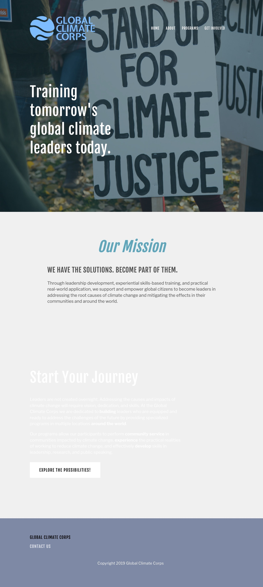

_Sample Page:_ <br>
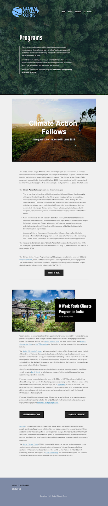

#### New Website Purpose:

- <strong>The new company is called "ClimateSAGE" and needs a new website</strong>
  - ClimateSAGE, unlike the old company, leverages wisdom and experience of elders
- Establish ClimateSAGE as a NEW organization and a separate brand, introduce ClimateSAGE to the world
- Website encourages people to eradicate climate crisis
  - By providing them many different types of resources
- Another important purpose of this website:
  - Ptomote the <strong> company mission of focusing on elders </strong>, who are a neglected part of the population
  - Help elders who want to make a difference
- Provide a way to access information/ raise awareness about climate change
- Give people <strong> ways to engage in action </strong> and provide space for people to share the ways they are making a difference in the environment


## Client Website Scope (Milestone 1)
> Your project should be ambitious, but not too large. A good rule-of-thumb is that you should have about 1 content-full page for each team member.
> Explain why the website you will create for your client isn't too small and isn't too big. Explain why you think it's the right size for this project.

The website we are planning to create for our client will be four to seven pages and will focus on the direct call to action that our clients Nathan and Laura emphasized during our first client meeting. This means that we will have at least one content-full page per team member. This website will not be too large because Laura and Nathan want it to be image-heavy and be elegantly minimalistic with carefully thought-out space that signifies to the viewer that there is space for them in the organization. Based on this, all the content on the website will be appropriately and intentionally chosen and will not be overwhelming. This also means that the website will not be too small because all the content will be chosen with Nathan and Laura's design preferences in mind. For instance, every bit of negative space will be added with the intention of creating space for website viewers to join the organization. Additionally, images will be used quite a bit because Nathan and Laura feel that that is the direction in which websites are going nowadays and that's what appeals to youth the most. All the content will be chosen very intentionally and spread out across the four or five pages of the website, so it won't be too small or too large.


## Client Goals (Milestone 1)
> What kind of website do they want? What are their goals for the site?
> There is no required number of goals. You need as many goals as necessary to reflect your client's desires.

The client wants a website that can promote awareness and education about environmental issues, especially the global climate crisis. The specifically want to target youth and elderly since they believe these are two groups that can use their organization as a resource and make the world a better place!

- Goal A: Create a website that promotes environmental activism to youth as well as people 50 years or older.
- Goal B: Cater to the elderly who are interested in learning more about helping the environment as well as business partners and possible donors who support the organization's cause and visions.
- Goal C: Educate and raise awareness about the climate crisis to the youth and elderly. Provide leadership and training for youth to respond to climate issues.


## First Client Meeting Minutes/Notes (Milestone 1)
> Include your notes/minutes from the client meeting.

Nathan initially responded to the inquiry for clients regarding the Global Climate Corps website, but that organization is no longer active. However, he envisions a new organization that will work with youth and build a capacity with them to respond to climate issues. They’re switching gears to focus on climate awareness, education and action as well as on elders in addition to youth. Elders have a lot of wisdom and experience and they want to leave a legacy behind - they’re also such a neglected population, so Nathan and Laura want to work more with them.

They envision a different organization called Climate SAGE that leverages elders in the fight for climate action and builds bridges between youth and elders for intergenerational action. They think that engaging elders is often overlooked and they really want to change that. Laura’s work has been very important in changing the paradigm. For the work that we’re doing for our project, they want us to treat Climate SAGE as a separate organization from Global Climate Corps - we’d be helping them build a new website and brand instead of just building a website for an existing organization. We wouldn’t be working on both websites but just focusing on Climate SAGE. After discussing their vision for Climate SAGE, we asked them the questions in the questionnaire (see the notes for each respective question above).

They told us they would send us a concept outline for Climate SAGE (they sent it to us shortly after the meeting via email). This project concept has some richness to it in that they want to engage people in action to eradicate the challenges involved with the climate crisis but they also want to create opportunities to build relationships between young adults and elders to shift how we see the roles of youth and elders in our society.

At the end of the meeting, we discussed some of the limitations of the project (as outlined on the write-up) and told them that we would be in touch with some more information about the limitations of the project and any other requirements we have to fulfill. We also told them we'd send them our schedule for the project so that they'd have an idea about when they would have to send us content, when we would get them the final website and other important dates.


# Plan/Schedule (Milestone 1)
> Make a plan of when you will complete all parts of this assignment.
> This plan is for your team. There is no required format. Format it so that it works for you!

- Ask for client content by November 3rd.
- Non coding assignments aka pre planning (card sorting, etc.) due by November 5th.
- Reconvene with client November 8/9th.
- HTML due November 8th.
- CSS due November 10th.
- Interactivity/javascript due November 12.
- Reconvene with client between November 12 and November 17.
- Milestone 2: due 11/17
- User testing due November 19th
- Another meeting anytime before final submission (after user testing) November 22nd or 23rd
- Final submission 12/1


# Site Design/Plan (Milestone 2)

**Make the case for your decisions using concepts from class, as well as other design principles, theories, examples, and cases from outside of class.**

You can use bullet points and lists, or full paragraphs, or a combo, whichever is appropriate. The writing should be solid draft quality but doesn't have to be fancy.

## Understanding Users (Milestone 2)

### Audience (Milestone 2)
> Briefly explain your site's audience. Be specific and justify why this audience is a cohesive group with regard to your client's site. This audience should not be overly broad nor arbitrarily specific. It should be a cohesive group with similar _goals_.

Our audience is primarily elderly people who are interested in engaging with issues related to the climate. This audience also includes retired people who are looking for meaningful ways to spend their time.


### User Interview Questions (Milestone 2)
> Plan the user interview which you'll use to identify the goals of your site's audience.

**User Interview Briefing & Consent:** Hi, I am a student at Cornell University. I'm currently taking a class on web design and for a project I am (re-)designing a web site for _Climate SAGE_. I'm trying to learn more about the people that might use this site. May I ask you a few questions? It will take about 10-15 minutes. You are free to quit at any time.

1. Please tell me a little bit about yourself. You can omit any private or personal information.

2. Are you interested in climate-related issues? If so, what kinds of issues?

3. When you look for information about climate change, what kinds of information do you seek out? Where do you look for that information/how do you obtain it?

4. When looking to make an impact or bring awareness on climate change, do you feel as if your age changes how society views your actions or worldview?

5. Given your age, what hinders you or helps you with your experience when using a website?

6. When you look at a website, do you gravitate towards visually focused pages or textually focused pages?

**After the interview:** This was really helpful. Thank you so much for agreeing to speak with me today. Have a great day!


### Interview Notes (Milestone 2)
> Interview at least 4 people from your audience. Take notes and include those notes here. Make sure to include a brief description of each interviewee.

**Interviewee 1:**

_Description:_ This interviewee is above the age of 50, currently employed full-time in the financial services industry in a product development and business role. He has worked in multiple locations in his life and currently resides in New Jersey with his wife and children.

_Notes:_
- He is interested in climate-related issues because they affect our future and the well-being of future generations as well as the quality of life that can be expected in the years to come. To him, he is most interested in global warming and the fact that the snow caps are melting because he loves mountaineering and that bothers him a lot. He also thinks that the increasing toxicity and level of pollution in the air is very concerning.
- When he looks for information about the climate, he looks for information about areas like the Maldives that are affected by rising water bodies. He looks for local news sources related to specific locations for news about how climate change is affecting specific regions of the world. He likes to deal more with facts instead of opinion so he sticks to unbiased news sources.
- He thinks that his age and generation have an impact on how he addresses climate issues because his generation is settled and can focus on spending their money on eco-technology that can help the planet, such as electric vehicles and solar panels, and he also feels that his generation donates a lot of money and can focus their donations towards environmental causes.
- When he looks at websites, he always looks at how intuitive and easy to use it is and enjoys when he doesn't have to see a lot of marketing content before he sees the primary information. He wants to see the factual content and information first. He wants photographs and illustrations primarily because he feels that a picture is worth a thousand words. In general, he wants ease of use, whether it can hold his attention and whether it's fact-based. He also wants to know whether he can sign up somewhere on the website to get information pushed to him regularly as opposed to having to continually visit the website. He also wants to make sure that the content gets updated regularly.
- He is a visual person so he gravitates more towards images, charts and graphs. He also wants to see text that will explain the images, but he primarily wants visual content. He likes facts and data.


**Interviewee 2:**

_Description_
1. He is above the age of 50 who is currently employed as a full-time data scientist. His part-time research focuses on how to find insights from big data and spatial GIS/disaster management.

_Notes_
2. He is interested in climate-related issues particularly related to the rise in frequency of flooding and hurricanes, because his geography research pertains to this topic.

3. He looks for information that affects precipitation such as rain which therefore affects flooding. He looks for this information through NOAA. He also likes to look at CNN, because he is Atlanta-based.

4. He thinks the generation older than him do not think about the effects of climate change, but for his generation, they are more aware and care more about this topic. He does not feel that people treat him different given his age when it comes to his actions or worldview pertaining to climate change.

5. He does not feel as if his age hinders him from using a website. Because he began studying and using the internet and computer science beginning in his undergraduate studies, he does not fill restricted or needs aid with using a website.

6. He prefers looking at charts and images, because he believes it is a more concise way to present information. He thinks that a chart or graph is worth a thousand words.


**Interviewee 3:**

_Description_
1. She is above the age of 50 who is currently employed as a full-time computer scientist. She is interested in gardening and composts.

_Notes_
2. She is interested in the negatives that come from global warming and its effects on greenhouse gases and wildlife. Since she is an avid gardener, she does her part by composting, which lowers our landfill amount and thus decreases methane gases released.

3. She looks for information that affects the weather mostly pertaining to crops and precipitation. Since she prefers a more traditional way to obtain information, she checks sites such as CNN, weather.com, and UNEP, which clearly and relatively accurately depict our global situation.

4. She thinks her generation definitely thinks about the environment less than the generation today, however there are still efforts made through laws and regulations. Similarly, development of hybrid and electric cars contribute to a positive climate efforts. Additionally, many programs and education programs were started by her generation so although there is more awareness now, a lot of the environmental concerns were spearheaded in her generation.
5. She does not think her age hinders her from using a website and believes she knows more about the web than many individuals from generations after. Being a computer engineer for 20+ years she has definitely seen the development of the web and understands it at a level much higher than the average person.

6. She is a visual learner and likes looking at infographics, charts, and graphs. Coming from a different country, images are easier to understand and make it very presentable for someone who learned english as a second language.


**Interviewee 4:**

1. _Description_

She is 51, has two children, both in high school. Currently a librarian at Cornell University (Olin) and she is an Ithaca Native.

2. Yes!
Ithaca has a wastewater recycling facility that she volunteered at and she is generally passionate about water supply. Other than that, she enjoys supporting local farmers/ businesses and being outside.

3. Local newspapers and flyers, she said there's not a huge technology presence in Ithaca for climate related-issues

4. Yes, because most of the representation regarding climate change is sourced for high school/ university ages
- no media which is ironic because our generation cares about it so much, especially locally

5. She doesn't have much trouble with websites and doesn't feel that her age hinders her at all from navigating them. She says newer social media platforms are hard to navigate but she likes that Facebook is a platform for ppl her age

6. Visually because it grabs her attention and then she focuses on it more


### Goals (Milestone 2)
> Analyze your audience's goals from your notes above. List each goal below. There is no specific number of goals required for this, but you need enough to do the job (Hint: It's more than 1 and probably more than 2).

Goal 1: The audience (elders interested in helping the environment) needs a resource like Climate SAGE that is tailored to them. So, the first general goal is to give the audience a website that is clearly targeted towards elders and that is accessible and usable for elders.

- **Design Ideas and Choices** _How will you meet those goals in your design?_
  - incorporate imagery with photos of elders in nature
  - We will include a large image on every page and emphasize images in the design of our pages as much as possible to make our content visually-focused and less based on text.
- **Rationale & Additional Notes** _Justify your decisions; additional notes._
  - the imagery of real elders in nature will help elders feel represented and included by the site
    - Interviewers said that current environment resources are clearly targeted towards young people, so this way elders will see that there is an organization that is for their generation specifically
  - Incorporating a lot of imagery is more accessible for elders and is preferred to a lot of text, so this will make the site more usable for them
    - Our clients specifically mentioned that it's easier to focus on visuals and not text on screens/ websites!

Goal 2: The audience needs access to information/ resources avaliable about specific ways that they can help with the climate crisis and the environment in general.
- **Design Ideas and Choices** _How will you meet those goals in your design?_
  - Include all resources about Climate SAGE programs on the same page that is clearly tited "Engagement" so that people know where they should go and can find all of this information in one Places
- Make the navigation bar clear and simple (not a lot of styling, no serif fonts etc.) ! text vs backround should have a high color contrast
- back darkground with white text
  - We will also implement accordion and tab interactivity so users can find information based on the topic names.
- **Rationale & Additional Notes** _Justify your decisions; additional notes._
  - Multiple users mentioned during user interviews that they really value ease-of-use in a website and that is often related to navigation. A website that is tough to navigate is often frustrating for a user to use, so we want to focus on making navigation as easy as possible
  - The nav bar will be at the top of each page so its immediately accessible and visible when a user lands on any of our pages
  -  The high contrast improves accessibility because white words are more visible for elders/ for people in general when on a dark background
  - It will be easier for users to find specific information by topic with accordion and tab titles.
    - This way, users only have to view descriptions about the topics/ programs that interest them
    - Less scrolling and less time searching for and finding a way to help

Goal 3: Provide users a simple way to actually begin the process/ join the organization
- **Design Ideas and Choices** _How will you meet those goals in your design?_
  - Make a large and visible button that allows users to contact Climate SAGE
  - We will likely include a Google Form in some kind of "Contact Us" page or section of the website that a user can fill out if they want their information recorded for the organization's leaders.
- **Rationale & Additional Notes** _Justify your decisions; additional notes._
  - The users want more than just information about ways they can help the environment, they need a way to actually join the organization + begin doing things, going to events etc.
    - If the link is clear and brightly colored, users can easily find contact information and get started with Climate SAGE


## Content Planning (Milestone 2)

**Plan your site's content.**

### Your Site's Planned Content (Milestone 2)
> List the content you plan to include your personal website. This should be a comprehensive list.

- description of Climate SAGE
- introduction to organization leadership
- headshots of ClimateSAGE leadership
- description of Climate SAGE's intended audience
- description of SEEDS podcast
- description of CIRCLES forum
- description of DELEGATIONS
- description of EXPEDITIONS
- description of intergenerational actions
- answering "Why Climate SAGE?"
- answering "Why SAGEhood?"
- link to google form
- "organization vision" video link


### Content Justification (Milestone 2)
> Explain (about a paragraph) why this content is the right content for your site's audience and how its addressed their goals..

We need a description of the organization in order to inform people about its goals and structure. Our clients also wanted to include some information about them to give users a background on why they are interested in climate action, so we would include their bios and headshots. We would include a description of the organization's intended audience as a sort of "call to action" to the users who fit that description. We would then include separate descriptions of the four separate engagement pathways that the organization offers: the SEEDS podcast, the CIRCLES forum, DELEGATIONS and EXPEDITIONS. Then there would also be a description of intergenerational actions that the organization would participate in. This is important to the organization's leaders because they envision one of the main missions of the organization to be uniting younger and older generations in the fight against climate change. The "Why Climate Sage?" and "Why SAGEhood?" portions of content are crucial because they emphasize the importance of the organization's mission. The Google Form link is crucial because that's how users will contact the organization's leaders. Finally, the video link is important because it involves one of the leaders, Nathan, describing the organization's vision, which is a nice personal touch that shows off the people behind the organization.


## Information Architecture (Milestone 2)

### Content Organization (Milestone 2)
> Document your iterations of card sorting here.
> Include photographic evidence of each iteration of card sorting and description of your thought process for each iteration.


This first card sort groups the content by the Global CLimate Corps 4 overarching topics: Home, Who We Are, Why We Are Here, Lets Connect. The home page contains basic information like what the organization is. Who we are contains more in depth information like the different programs. Why We Are Here contains why SAGEhood and the mission and vision of Global Climate Corp. Finally, Lets Connect has a google form and contact info to bring the users together.

This second card sort is more general and has 2 main pages containing home and all the descriptive and basic information on one page and the organizations visions/contact information on the next. This is much more concise and peope may find this better.

The third card sort combines the websites description and mission in a page while leaving the contact info and google form in the next. The reasoning behind this is the same as the card sort 2, where content is combined for easier and more concise navigation.


### Final Content Organization (Milestone 2)
> Which iteration of card sorting will you use for your website?

Card sorting 1 is what we will use. It divides the content into sensible topics and allows the user to better pinpoint where to go if they have a specific topic they are looking for. It makes sense to have a home page, who we are, mission statement, and connect pages. Further, through meetings with the client, this is the general format they prefer.

> Explain how the final organization of content is appropriate for your site's audiences and their goals.

The first group we have has two cards: a description of Climate SAGE and a link to a video made by one of the organization's leaders. This makes sense because these pieces of content provide a basic overview of the organization and we envision these pieces of content being on our site's homepage. Next, we have a group with a description of Climate SAGE's intended audience, a description of the intergenerational action that the organization envisions and then separate information about the four different engagement pathways that the organization envisions: the CIRCLES forum, the SEEDS podcast, DELEGATIONS and EXPEDITIONS. This group of content essentially describes what the organization does. The third group of content would include information that answers the questions "why Climate SAGE?" and "why SAGEhood?" which answers the question of why this organization is doing what they are doing. The fourth group would include headshots and introductions to the leaders of the organization, which would provide information about who is running the organization. Finally, the last group would include a single piece of content, a link to a Google Form that users could use to contact the organization's leaders, sort of like a "Contact Us" form.

### Navigation (Milestone 2)
> Please list the pages you will include in your personal website navigation.

- Home
- What We Do
  - SAGE Engagement
  - Intergenerational Action
- Why We're Here
  - Why Climate SAGE?
  - Why SAGEhood?
- Who We Are
- Let's Connect

> Explain why the names of these pages make sense for your site's audience and their goals.

The "Home" page is aptly named because that's the main page that the users see right away and "Home" is a common moniker used for the initial landing page of a website. "What We Do" is appropriately named because the two pages that fall under that dropdown title (SAGE Engagement and Intergenerational Action) accurately sum up what the organization does. "Why We're Here" makes sense because the pages that fall under that dropdown title (Why Climate SAGE? and Why SAGEhood?) describe the background behind why the leaders created the organization and why they feel that its work is necessary. "Who We Are" is a good name because it provides information about the two leaders of the organization. Finally, "Let's Connect" is aptly named because it provides a link to a Google Form that users can fill out to get in contact with organization leadership.


## Design (Milestone 2)

### Visual Theme (Milestone 2)
> Discuss several (more than two) ideas about styling your site's theme. Explain why the theme ideas are appropriate for your target audiences.
> Note the theme you selected for you site and why it's appropriate for the audience and their goals.

Our first theme idea is to go fully black and white with sans serif font to highlight the simple, direct nature of the organization's vision and to provide maximum readability and visual contrast to make it easier for the website's audience to take in the content of the website itself.

Our second theme idea is to use clean, natural-looking tones (beige, blue, etc - like sand and water) and sans serif fonts because that highlights both the natural, climate-related theme of the organization and still provides very easy-to-read textual content that would be easier for people to take in visually.

Our third theme idea is to use very peppy, bright, almost neon colors and sans serif fonts. The fonts would be very readable but the bright nature of the colors would also provide a strong call to action for the users and really draw their attention in.

The theme we are selecting is the second theme with natural tones and sans serif fonts. That really pays a nice homage to the climate-focused goal of the organization with the colors and the sans-serif fonts makes things really readable for the users, which is really important because the intended audience includes elderly individuals who might not be used to reading off of screens.


### Interactivity Ideas (Milestone 2)
> Brainstorm several ideas for your site's interactivity.
> Provide a very brief summary how each idea improves the usability of the site for the site's audience.

- **Drop down menus for the "What We Do" AND for "Why We're Here" nav bar elements**
    - Each of these pages contains distinct pieces of content. The drop down menu would easily allow the audience to understand what specific topics each page contains
    - The menu also allows users to <em>choose</em> the section of content they want to see by simply clicking the link on the drop down menu which prevents searching for sections and extra scrolling.
- **Accordion for the written content in "SAGE Engagement"**
  - This is easily the most text-content-heavy section of the entire site
  - All of the information about how to engage with SAGE is relevant, but the user can <b>choose</b> which topics they want to read more deeply about/ the topics they are interested in by selecting the appropriate drop down on the accordion. Also, without this accordion, the page is very crowded with text and it would be difficult to see the range of activities that SAGE has to offer if there was no interactivity implemented for this section of the site. Users will be able to understand all of the options available to them by quickly scanning the topics on each row of the accordion.
- **Tabs for the leaders' headshots and bios**
  - Will allow for more efficient usage of space and allow users to focus on information about one leader at a time
- Hamburger menu for the mobile version of the website to allow for a more efficient navigation
  - The hamburger menu will take up less space on the page because it will only be visible once the button is clicked and this will be less overwhelming for the users because they will not need to see the menu when they don't need to navigate to another page. It will also allow for a better usage of space on the mobile version of teh website.

### Layout Exploration (Milestone 2)
> Iterate on your site's design through sketching.
> Sketch both the mobile and desktop versions of the site.
> Here you are just exploring your layout ideas. You don't need to sketch every page.
> Provide an explanation for each sketch explaining the idea and the design patterns you are leveraging.

**Home Desktop Sketch 1:**
  
  - This sketch emphasizes the company's title and <b>mission statement</b>
  - The name "Climate SAGE" is likely unfamiliar for users, so we need to emphasize the organization's logo and mission statement on the home page so people immediately understand what the organization is all about!
  - Unlike a busy and potentially distracting hero image with no content, there is a background behind the company logo and mission statement of an image of the earth and water
  - The background image only has two, uniform sections that are divided diagonally which provides a natural and organized boundary between the heading and the mission statement
  - this background has bright blue and green colors that are eye catching, so users will be even more inclined to focus on the text content that is on top of the image.
  - The content below the main background img changes up the layout to adjacent columns with important text on the left
    - Text on the left helps users read naturally as we read left to right; this also emphasizes the text content about what Climate SAGE addresses
  - The "video" (which is actually just an img with an interactive play button) is centered so it is a focus point and users are drawn to click on it


**"What We Do" Desktop Sketch:**
  
- The main text for the top is on the left and the image is on the right so that the users will focus more on the text to the left when they are reading left to right: this is important information
-  There is an accordion on this page to divide up all of the information about engagement opportunities that are listed
  - There is a lot of information and a lot of opportunities, so it makes sense to show users all of their options and allow them to choose the opportunities they want to click on for more information
- There is a clear divide between the engagement and the intergeneration action sections of the page, as these are separate ideas and it should be visible that there is a divide between 2 categories of content on this page

**"Why We're Here" Desktop Sketch:**
  
- For this iteration of page design, there are 2 clearly defined sections (same concept as page example above)
- This could be an alternative to the design of the "What We Do" sketch layout since both of these pages have 2 clearly defined sections (probably an h2)
- This layout keeps the user focused on the categgory of content they are on: for ex. in the why sagehood section, there is a box with the definition of SAGE inside the "Why SAGEhood" flex box / div

**Home Mobile Sketch:**
  
- The nav bar for the mobile site has a hamburger menu that drops down when clicked instead of a navigation bar
  - this accounts for smaller screen space and allows there to be room for other site elements/ content
- To clarify the top image: the background is the same as the desktop site, but it will be a more "zoomed" in version of the image on mobile devices so it isnt too zoomed out and also so this image doesnt take up the entire screen
- The rest of the content is arranged in one column which is good for mobile devices since this prevents overcrowding with the more narrow mobile view
- Images and video are centered on mobile so they are more of a focal point and so they are more visible
- NOTE: most of our mobile pages will look very similar to this! The screen is much more narrow so we can often only fit one image or one paragraph element per row
  - we will generally use one large column for mobile to prevent overcrowding/ content being too small to view

**Mobile Menu Sketch:**
  
- This is the general sketch for what our mobile nav bar will look like (note that hamburger menu is in expanded/ clicked state in sketch)
- Because of much more narrow screen, we have to have less content spanning across our nav bar so users can see everything
  - Title still is in the center in order to draw attention to it
  - There is a little home icon in the right corner so a user can easily navigate to the home page when desired!
- It's important that the menu does not completely obstruct the users view of the page they are on so that they can easily recognize that they are in a dropdown menu and that the menu is just "on top" of the current page they are on
- We can keep the hamburger menu sticky so that users always have access to all the pages without any scrolling
- Add an up arrow? This would allow the user to click the arrow instead of needing to scroll all the way to the top of the page

### Final Interactivity Design (Milestone 2)
> Explain and/or provide annotated sketches of the interactivity you will implement for your site.
> Explain how the interactivity improves the usability of the site and helps the site's audiences meet their goals.

**Accordion Sketch:**
  
- On the "What We Do" page, there are several distinct sections of Content
  - for ex: Seeds, Circus, Delegations, and Expeditions
- each of these sections has a substantial amount of text
- The accordion will decrease crowding on this page, while allowing users to more easily see each engagement
- users can decide which opportunities they want to expand on the screen so they can find info on things they are most interested in

**Dropdown/Hamburger Menus:**
  
Description:
  - This is the general sketch for what our drop down menus will be structured like
  - There will be a drop down menu on the nav bar "what we do" and "why we're here" elements for the desktop site
  - On the mobile site, there will be a hamburger/ dropdown menu with all of the nav bar tabs
  - There will be an arrow pointing down on each dropdown button next to the text when the dropdown is closed
    - so users can recognize which menu items are dropdowns and which are not
    - Down arrow is commonly recognized as dropdown menu/ expand element
- there will be an up arrow instead of the down arrow next to the top nav element when the dropdowns are open
  - same justification as previous


**EDIT after User Testing (see "changes to make after user testing" section)-
- each link in the nav bar (desktop and mobile!) will be underlined when a user hovers over it
- pointer cursor over each clickable nav element as well!


Rationale:
  - The two pages listed have two or more distinct sections of content per page
  - Having the dropdown menu allows the user to preview the sections and decide what they want to click on
  - User does not need to scroll to access a subheading that they are interested in, they can click the nav link and be navigated there immediately
  - Helps separate sections of content that are quite different to prevent confusion/ emphasize each topic separately
  - for example: isers can find all Climate SAGE programs on the SAGE engagement page

**EDIT after User Testing (see "changes to make after user testing" section)-
- the user will know that each navigation element is clickable when they are hovering over it by the underline and the pointer

**Tabs:**
  
  - The tabs would be included on the "Who We Are" page and would be used to differentiate the content between the leaders/founders to allow for better usage of space. We propose having the tab buttons at the top of the page followed by the image of the leader after which would come the text about them.

  
  - This is an updated sketch for the tabs on the "Who We Are" page - we changed it after user testing because we had a user who didn't like that the text was at the bottom of the page; they thought it was less visible that way even though they felt it was the most important information. Therefore, we changed the layout so that the tab button are at the bottom of the page, the text is at the top of the page and the image remains in the middle.

### Final Design (Milestone 2)
> Include the final sketches for **each** of your site's pages.
> The sketches must include enough detail that another 1300 student could implement them.
> Provide a explanation for each sketch.

**Mobile Design:**
  
We decided to implement a hamburger menu that is expandable to be able to effectively use the limited space of a mobile screen. We will separate the four subpages on the desktop as their own pages for the Mobile Design, so that it is easier for the user to find on limited screen space. As for interactivity, we will also implement an accordion on the SAGE Engagement subsection of the "What We Do Page" along with the tabs on the "Who We Are" page. There will be little to none horizontal design as the screen width does not allow for effective design that way.

**Desktop Design:**
  
We decided to emulate the website of the parent organization which is founded and led by Nathan Scott as well. We wanted the desktop site to be similar design wise but still functional and logical for the content we have for this new organization. The nav bar will remain at the top across all pages with hero images as the backgrounds of the titles of the page. We will implement dropdown menus on two pages: "What We Do" and "Why We're Here." We feel that the information on these two subpages for each main page are different enough where having subpages will benefit the user to be able to go directly to that information rather than scrolling through the entire page to identify the information they are seeking. Furthermore, we plan on implementing accordions specifically on the SAGE Engagement subpage. This will further allow for more users to find exactly the information they are seeking. Our other instance of interactivity of the desktop design is the tabs on the page titled "Who We Are." This will feature the headshots and biographies of the organization's two leaders.

**Note:** We ended up removing the video from the homepage because the clients informed us later that they no longer wanted it to be included on the website. It was included in our original content list, card sorting and sketches, but it will no longer be on our website. Additionally, our clients requested that we make "SAGE Engagement," "Intergenerational Action," "Why Climate SAGE?" and "Why SAGEhood?" the pages and make "What We Do" and "Why We're Here" the names of the dropdown menus. We'll be using our idea for dropdown interactivity for this.


### Design Rationale (Milestone 2)
> Explain why your design is appropriate for your audience. Specially, why does your content organization, navigation, and site design/layout meet the goals of your users? How did you employ design patterns to improve the familiarity of the site for your audience?

The content organization allows users to quickly find information especially with the implementation of interactivity. With the dropdown menu, users will be able to quickly identify subsections of the pages "Why We're Here" and "What We Do." Within the "What We Do" subpage, the implementation of the accordion feature will allow for users to further find specific information quickly without the unnecessary information taking of space on the screen. This is particularly true on the mobile site design. With limited space, the accordion makes for a better use of the space. Furthermore, the use of tabs on the "Who We Are" page allows for users to switch between the organization's two leaders with a logical use of the space especially for the mobile site.


## Interactivity Plan (Milestone 2)
> Now that you've designed your interactivity for your site, you need to plan how you will implement it.
> Describe how you will implement the interactivity. This should be a complete plan that another 1300 student could use to implement the interactivity.
> You should list the elements, any CSS classes, events, pseudocode, and the initial state.

```
(LARRISA) For accordion on the SAGE Engagement subpage:
when #seeds-expand-button is clicked:
  remove .hidden from #seeds-content and #seeds-minimize-button
  add .hidden from to #seeds-expand-button
when #seeds-minimize-button is clicked:
  add .hidden from #seeds-content and #seeds-minimize-button
  remove .hidden from to #seeds-expand-button

when #circles-expand-button is clicked:
  remove .hidden from #circles-content and #circles-minimize-button
  add .hidden from to #circles-expand-button
when #circles-minimize-button is clicked:
  add .hidden from #circles-content and #circles-minimize-button
  remove .hidden from to #circles-expand-button

when #delegations-expand-button is clicked:
  remove .hidden from #delegations-content and #delegations-minimize-button
  add .hidden from to #delegations-expand-button
when #delegations-minimize-button is clicked:
  add .hidden from #delegations-content and #delegations-minimize-button
  remove .hidden from to #delegations-expand-button

when #expeditions-expand-button is clicked:
  remove .hidden from #expeditions-content and #expeditions-minimize-button
  add .hidden from to #expeditions-expand-button
when #expeditions-minimize-button is clicked:
  add .hidden from #expeditions-content and #expeditions-minimize-button
  remove .hidden from to #expeditions-expand-button


TALIA
for the dropdown menus on nav bar:

when #dropdownButton is clicked

  if #dropdownMenu has class hidden
    show #dropdown
  otherwise
    hide #dropdown

    if #upArrow has class hidden
      show #upArrow
      hide #downArrow
    otherwise
      show #downArrow
      hide #upArrow

(RHEA) This is the plan for the TABS on the "Who We Are" page:

when #nathan-tab-button is clicked:
  show #nathan-content;
  hide #laura-content;

when #laura-tab-button is clicked:
  show #laura-content;
  hide #nathan-content;

to show specific content:
  remove the hidden class from that content;

to hide specific content:
  add the hidden class to that content;

(RAY) Mobile Hamburger Button Display:
Function Where:
when #hamburger-button is clicked:
  toggle #nav-menu to active
When #hamburger-button is clicked again:
  toggle #nav-menu to not active
```


## Client Feedback & Minutes (Milestone 2)
> You should meet with your client again to obtain feedback on your design.
> Provide a summary of the client's feedback and your meeting's minutes.

We met with Nathan and Laura on Tuesday, November 16th at 5 PM. We started by thanking them for their time especially because Nathan recently lost his father. Larrisa started walking them through the final designs, which she drew.

Larrisa started by showing them the desktop design for her homepage and they discussed whether or not to include the video link that Nathan made because they weren't sure whether they needed it to be present. Then, Larrisa showed them the "What We Do" dropdown menu which would expand into the separate SAGE Engagement and Intergenerational pages - Larrisa suggested possibly putting images behind text but mentioned that Professor Harms isn't a fan of hero images and that we might use a plain background instead. We are focusing mainly on similar layouts throughout the website's different pages.

Larrisa then started showing them the mobile design and mentioned that the main difference with the mobile version is the hamburger navigation bar because the horizontal navigation bar wouldn't work on such a narrow screen. She also mentioned that there wouldn't be much side-by-side layout in the mobile version but things would come one after the other vertically. Laura also said that the designs were clear and she liked the implementation of the accordion. Nathan felt that he likes the direction we are going but asked how we're feeling about the photos - Larrisa mentioned the only thing we needed was Laura's headshot and bio but otherwise we're good on photographs and content.

We scheduled our next meeting for November 29th for them to see a complete draft of the website with interactivity implemented and then we plan to meet one more time around the final submission deadline to hand over the completed website to them.


# Evaluation (Final Submission)

## Finished Desktop & Mobile Website (Final Submission)
> Include screenshots of both the desktop and mobile version of your site that you will be using for user testing. (We need to see the "before" testing version of your site.)
> Use the FireFox screenshot feature to take screenshots of the entire page.

**Mobile Screenshots:**
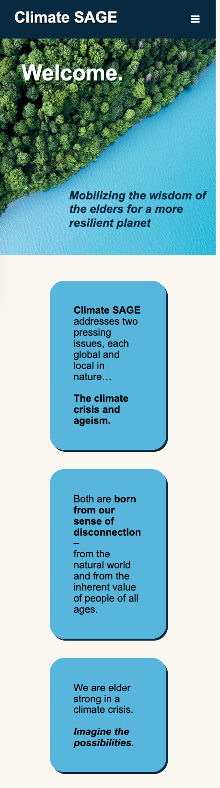
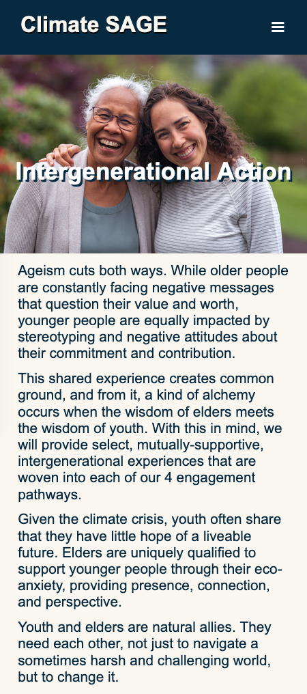
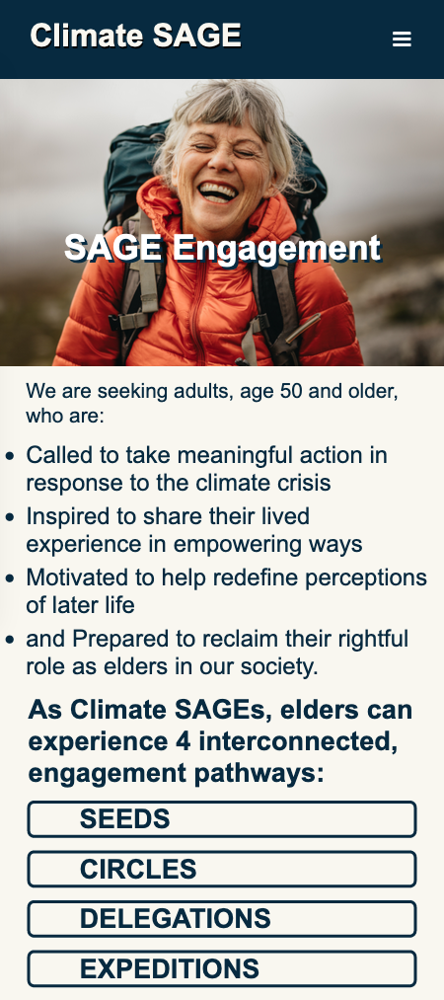
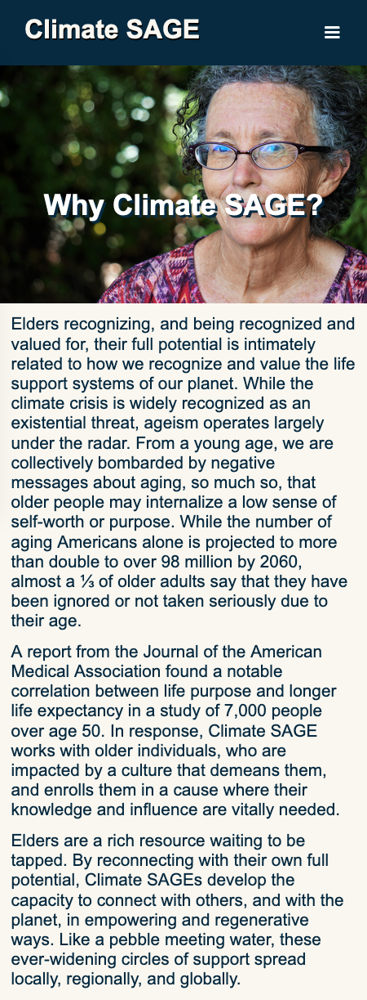
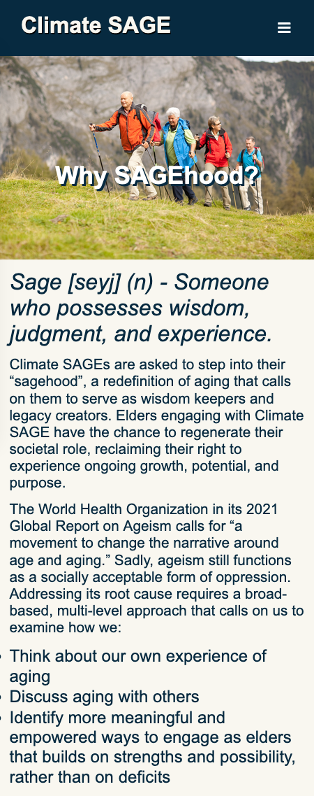
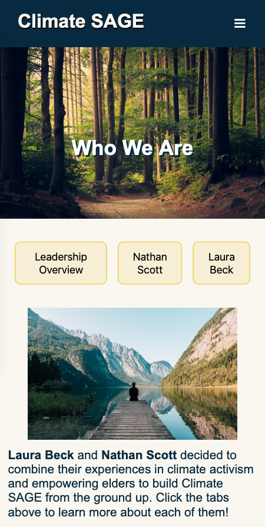
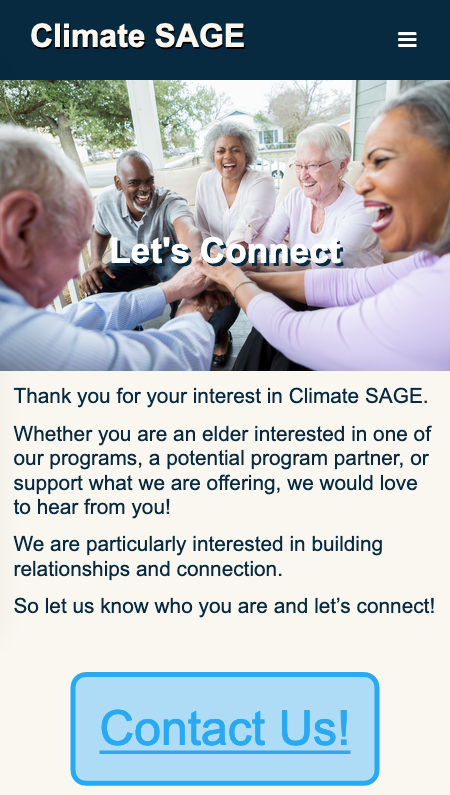

**Desktop Screenshots:**
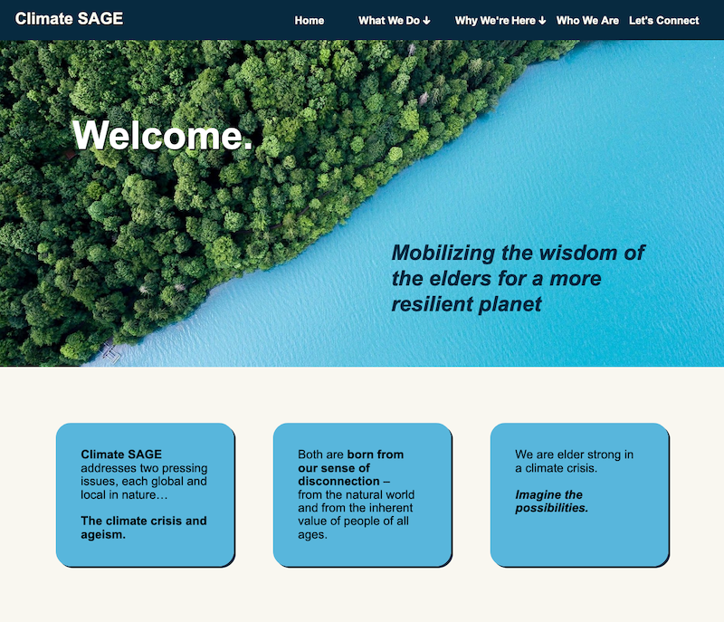
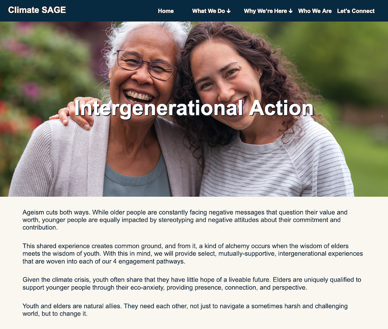
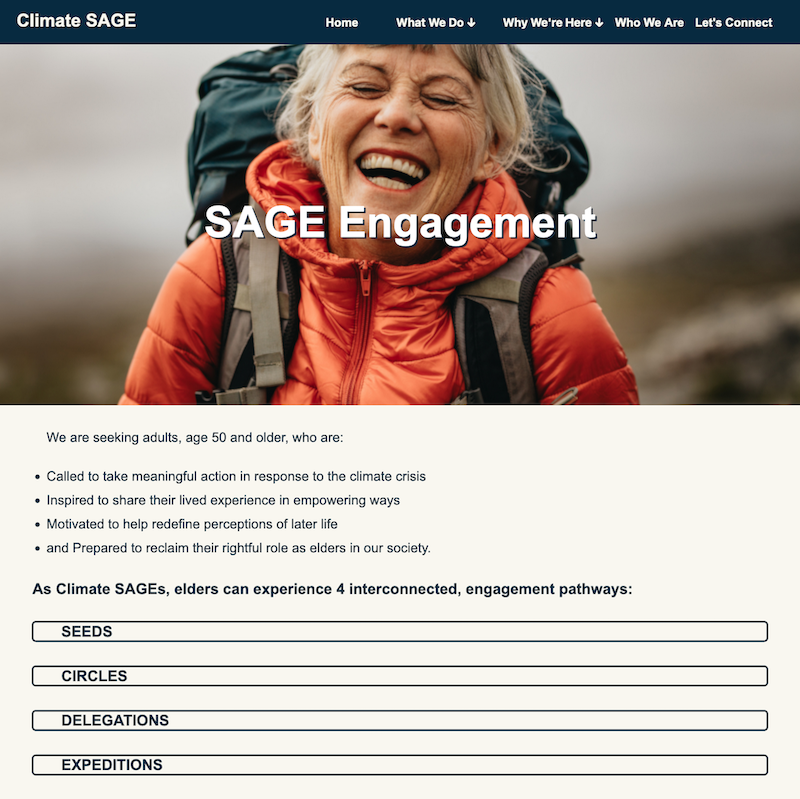
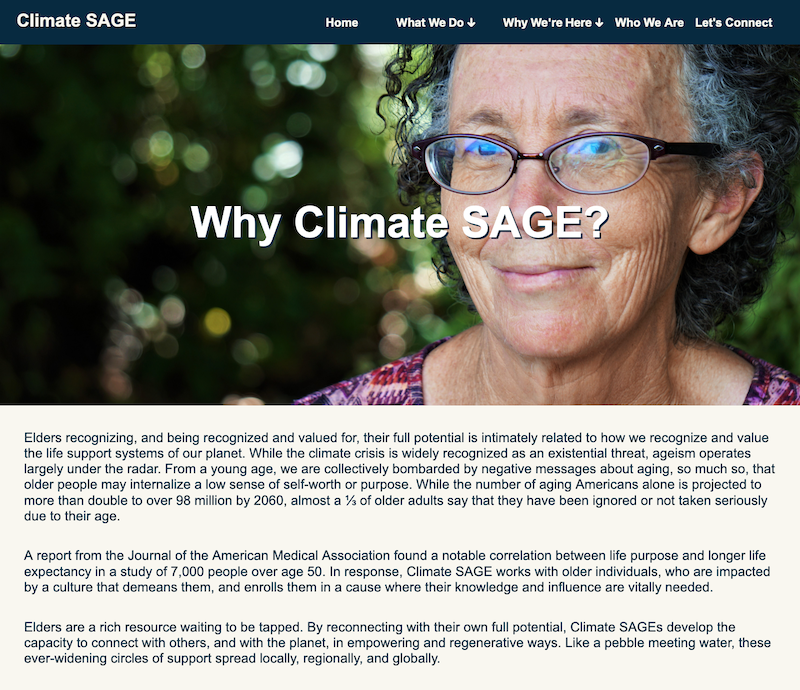
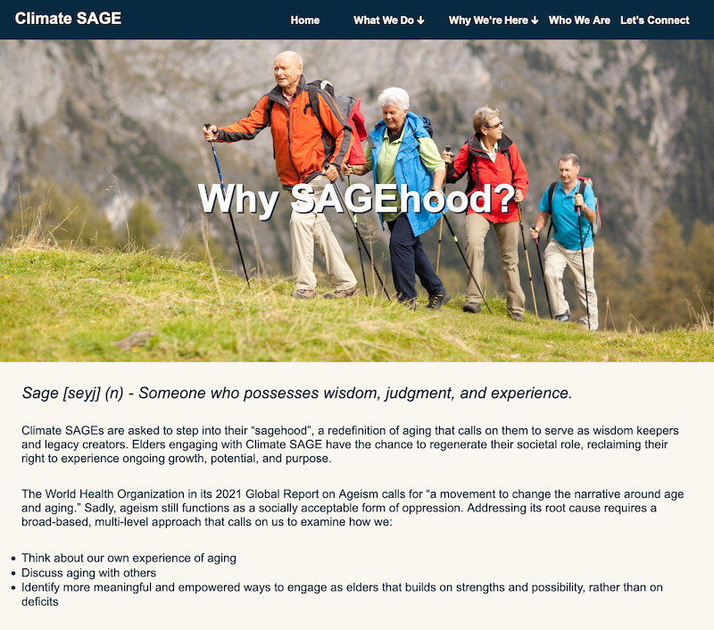
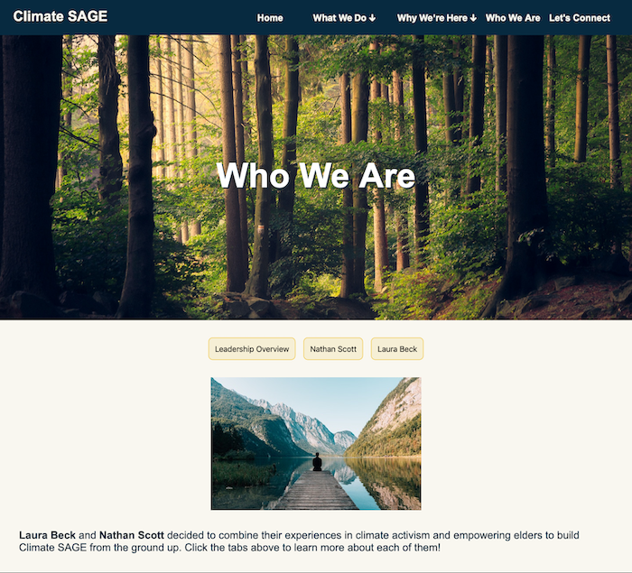
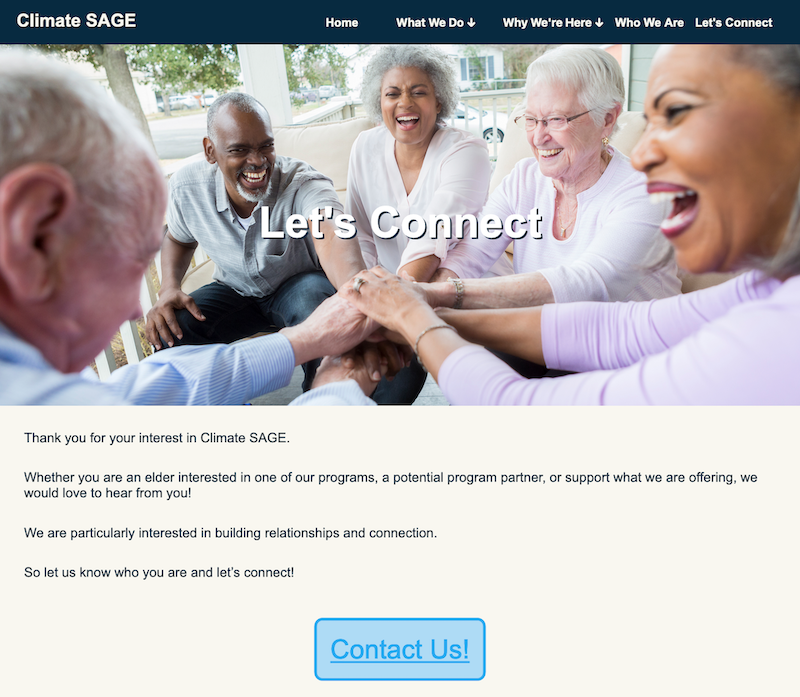

## User Testing (Final Submission)

**Conduct user testing with a minimum of 4 participants.**

### User Testing Tasks (Final Submission)
> Plan out your user testing tasks before doing your user testing. These must be actual user testing tasks. **Tasks are not questions!**

1. You come across the Climate SAGE website and haven't heard of the organization before. Explain the organization's purpose.

2. You want to know the target audience that Climate SAGE is looking to harness as part of their organization. Find the audience they are seeking to involve in their work.

3. You decide you want to get involved in Climate SAGE. Find two specific programs/experiences/offerings that you can participate in.

4. You want to find the names of Climate SAGE's founders and leaders. Find their names.

5. After browsing through Climate SAGE's website, you decide you want to know more information about their mission and want to contact one of the organization's founders. Find a way to contact the founders.


### User 1 - Testing Notes (Final Submission)
> When conducting user testing, you should take notes during the test. Place your notes here.

1. She says it’s figuring out what to do about climate change and she got that from the subtitle on the Home Screen. She says it must be galvanizing public support and opinion to address climate change. In their approach they’re looking at ancient wisdom and looking at what our ancestors did and whether we can follow them. She did not try to look at any other pages on the website to find the answer to this question - she did not even click the hamburger menu button.

2. She read through the homepage very intently and found from the blue boxes that mature people are being targeted and encouraged to get involved. She also looked at the Intergenerational action page and found that they want youth to engage with elders intergenerationally to get elders’ wisdom and the action of youths together.

3. She went to the Why SAGEhood page and didn’t find what she was looking for. She then went to the SAGE Engagement page and pointed out SEEDS as an option and that’s with the podcast and the course. Then there’s CIRCLES for people involved with education and action. Then she pointed out DELEGATIONS and EXPEDITIONS, so she mentioned all four engagement pathways, the four programs people can participate in. She said she initially didn't realize she could click each of the pathways (the accordion) to read more about them and that she wished that were more obvious.

4. She went to the Who We Are page immediately and saw the names Nathan Scott and Laura Beck on the tabs and said those were the answers.

5. She immediately went to the Let’s connect page and clicked on the contact us button and found the Google form.


### User 1 (Final Submission)
> Using your notes from above, describe your user by answering the questions below.

1. Who is your user, e.g., where does the user come from, what is the user's job, characteristics, etc.?

This user is an elderly schoolteacher from New Jersey who is interested in climate issues and would like to get more involved with them once she retires.


2. Does the user belong to your audience of the site? (Yes / No)
> If “No”, what’s your strategy of associating the user test results to your audience’s needs and wants? How can your re-design choices based on the user tests make a better fit for the audience?

Yes - she is an elder who is interested in climate issues.


### User 1 Results (Final Submission)
> Report the results of your user's test. You should explain **what the user did**, describe the user's **reaction/feedback** to the design, **reflect on the user's performance**, determine what **re-design choices** you will make **for EACH task**. You can also add any additional comments.

1. You come across the Climate SAGE website and haven't heard of the organization before. Explain the organization's purpose.
- **Did you evaluate the desktop or mobile design?**
  - Mobile
- **How did the user do? Did they meet your expectation?**
  - She made an inference based on the subtitle visible on the homepage which was a valid inference to make. However, she didn't even try looking at any other pages on the site; she just scrolled up and down on the homepage.
- **User’s reaction / feedback to the design** (e.g., specific problems or issues found in the tasks)
  - She did not state anything related to the design.
- **Your reflections about the user’s performance to the task**
  - The fact that she didn't really seem to notice or use the hamburger button right off the bat makes me think she didn't realize it was clickable.
- **Re-design choices**
  - We should darken the hamburger button when it's hovered over so users know it's a clickable button.
- **Additional Notes**
  - The darkening of the hamburger button could likely be applied to all other buttons on the website for continuity.

2. You want to know the target audience that Climate SAGE is looking to harness as part of their organization. Find the audience they are seeking to involve in their work.
- **Did you evaluate the desktop or mobile design?**
  - Mobile
- **How did the user do? Did they meet your expectation?**
  - She made inferences based off the information she found on the homepage and Intergenerational Action page and accurately summarized the audience even though she wasn't reading it word-for-word from the SAGE Engagement page, where it's listed.
- **User’s reaction / feedback to the design** (e.g., specific problems or issues found in the tasks)
  - She didn't mention anything about design during this task.
- **Your reflections about the user’s performance to the task**
  - She performed the task well and got her information by reading multiple different pages.
- **Re-design choices**
  - Based on this task, I feel the current design is sufficient.
- **Additional Notes**
  - We are using all the content the client gave us because that's what they wanted us to do but it seems that similar information can be gleaned from multiple different pages.

3. You decide you want to get involved in Climate SAGE. Find two specific programs/experiences/offerings that you can participate in.
- **Did you evaluate the desktop or mobile design?**
  - Mobile
- **How did the user do? Did they meet your expectation?**
  - She performed the task well by naming all 4 engagement pathways from the page. However, she didn't go to the "correct" page first, but rather another page.
- **User’s reaction / feedback to the design** (e.g., specific problems or issues found in the tasks)
  - It took her a few moments to realize the accordion was clickable and she wanted that to be more obvious.
- **Your reflections about the user’s performance to the task**
  - She performed well and got the desired information quickly.
- **Re-design choices**
  - We should make the accordion tabs darken when hovered over so the user knows they're clickable.
- **Additional Notes**
  - The Why SAGEhood? and SAGE Engagement pages have simiilar titles, so her choice of going to one and then the other seems logical to me even though she didn't go to the one with the desired information first.

4. You want to find the names of Climate SAGE's founders and leaders. Find their names.
- **Did you evaluate the desktop or mobile design?**
  - Mobile
- **How did the user do? Did they meet your expectation?**
  - She immediately went to the Who We Are page and found the founders' names.
- **User’s reaction / feedback to the design** (e.g., specific problems or issues found in the tasks)
  - She did not mention anything about design during this task.
- **Your reflections about the user’s performance to the task**
  - She did a very good job.
- **Re-design choices**
  - Her performance in this task was great so I think the current design is fine.
- **Additional Notes**
  - I think this was the speediest task; she seemed to immediately know which page to go to based on the title, which makes me think the title is a good one.

5. After browsing through Climate SAGE's website, you decide you want to know more information about their mission and want to contact one of the organization's founders. Find a way to contact the founders.
- **Did you evaluate the desktop or mobile design?**
  - Mobile
- **How did the user do? Did they meet your expectation?**
  - She immediately went to the correct page and clicked the form link, so she met my expectation quickly.
- **User’s reaction / feedback to the design** (e.g., specific problems or issues found in the tasks)
  - She did not mention anything about design.
- **Your reflections about the user’s performance to the task**
  - She performed very well.
- **Re-design choices**
  - She completed the task perfectly and quickly, so I don't think a re-design is needed.
- **Additional Notes**
  - It would be ideal if we could have the form on the webpage instead of just a link to a Google Form but that's beyond the scope of 1300.


### User 2 - Testing Notes (Final Submission)
> When conducting user testing, you should take notes during the test. Place your notes here.

1. You come across the Climate SAGE website and haven't heard of the organization before. Explain the organization's purpose.

- user immediately begins reading the home page
- does not scroll, just looks at landing page immediately visible
- user says that org is suppsoed to get elderly ppl excited about saving the environment

2. You want to know the target audience that Climate SAGE is looking to harness as part of their organization. Find the audience they are seeking to involve in their work.

- She again does not click on anything and she says "I am assuming that its my generation because the description on the home page says elders"
- User does not elaborate further

3. You decide you want to get involved in Climate SAGE. Find two specific programs/experiences/offerings that you can participate in.

- She clicks on "Why Were Here" but the link doesnt open anything
- she then clicks "what we do" dropdown and then on SAGE Engagement

4. You want to find the names of Climate SAGE's founders and leaders. Find their names.

- clicks on who we are immediately
- She sees the tabs for nathan and laura and reads them but does not click them
- she looks around the page for a little and eventually sees the sentence at the bottom and says that Nathan and Laura are the founders so she would asssume they are also the leaderes

5. After browsing through Climate SAGE's website, you decide you want to know more information about their mission and want to contact one of the organization's founders. Find a way to contact the founders.

- goes to "let's connect" immediately
- clicks "contact us" button immediately
- she says that she thinks this is the form but is confused as to why it isnt on the site and why it goes to google  

### User 2 (Final Submission)
> Using your notes from above, describe your user by answering the questions below.

1. Who is your user, e.g., where does the user come from, what is the user's job, characteristics, etc.?

my user is a 74 year old woman from Rochester, NY. She used to own a dance studio and is now retired. She is a fairly active and social person and seems very lively.


2. Does the user belong to your audience of the site? (Yes / No)
> If “No”, what’s your strategy of associating the user test results to your audience’s needs and wants? How can your re-design choices based on the user tests make a better fit for the audience?

Yes, she is a member of the audience as she is an elderly person looking for meaningful ways to spend her retirement.


### User 2 Results (Final Submission)
> Report the results of your user's evaluation. You should explain **what the user did**, describe the user's **reaction/feedback** to the design, **reflect on the user's performance**, determine what **re-design choices** you will make **for EACH task**. You can also add any additional comments.

1. You come across the Climate SAGE website and haven't heard of the organization before. Explain the organization's purpose.

- **Did you evaluate the desktop or mobile design?**
  - Desktop
- **How did the user do? Did they meet your expectation?**
  - Yes, the user met my expectations. The description of Climate SAGE is supposed to be obvious and not require a lot of searching. The user very quickly read the content at the top of the home screen and understood what the organization's purpose was.

- **User’s reaction / feedback to the design** (e.g., specific problems or issues found in the tasks)
  - There was no issues that the user reported
- **Your reflections about the user’s performance to the task**
  - The user answered this more quickly than I thought they would have and exceeded my expectations. She looked at the page and found the information immediately without even scrolling through the home page
- **Re-design choices**
  - None for this part!
- **Additional Notes**
  - The user answered this question accurately, quickly and with ease so there are no changes that should be made regarding this question since the current design seems to effectively convey Climate SAGE's purpose.

2. You want to know the target audience that Climate SAGE is looking to harness as part of their organization. Find the audience they are seeking to involve in their work.

- She again does not click on anything and she says "I am assuming that its my generation because the description on the home page says elders"
- User does not elaborate further

- **Did you evaluate the desktop or mobile design?**

  - Desktop

- **How did the user do? Did they meet your expectation?**

  - The user answered this task very quickly and she was mostly accurate. The user did not meet my expectations for the level of detail in her answer. The response "my generation" is pretty vague and the answer was less specific than what I was expecting

- **User’s reaction / feedback to the design** (e.g., specific problems or issues found in the tasks

  - the user did not have any reaction

- **Your reflections about the user’s performance to the task**

  - The user performed this task as quickly as possible and with less effort than I expected. I expected her to look at the SAGE engagement page or other places on the website for more information, but she did not navigate through the website at all and did not have as complex of an understanding about the audience of the site as I had hoped. She didn't do anything explicitly wrong, but the user's answer lacked detail.
- **Re-design choices**

  - No changes to the design.

- **Additional Notes**

  - I do not think we can use the users performance to this task to make any decisions to the design, as the user literally did not even scroll down the home page and was confident that their answer was completely correct. There is just not enough information to deduce anything.

3. You decide you want to get involved in Climate SAGE. Find two specific programs/experiences/offerings that you can participate in.

- **Did you evaluate the desktop or mobile design?**

  - Desktop

- **How did the user do? Did they meet your expectation?**

  - Yes, the user found the correct information in a relatively short time. She first tried to click on the "Why We're Here" but quickly clicked the "Who We Are" dropdown and then went straight to "SAGE Engagement". The user found the SEEDS program that she could join which met my expectations. However, the user didnt provide a second program in her answer and seemed to forget that I asked her to list 2 specific options.

- **User’s reaction / feedback to the design** (e.g., specific problems or issues found in the tasks)

  - User didn't have any reaction. Although, I will note that she seems to put very little effort into each task and is a bit careless/ unintentional with her navigation (i.e. she immediately clicked the "why were here" link which seemed random and accidental)

- **Your reflections about the user’s performance to the task**

  - The user performed this task completely correct for the one program that she did mention, however she did not even attempt to look for a second program. I think she just forgot that I asked for 2 programs because she seemed confident about her answer. Since her answer was correct and she was able to easily find and access programs on SAGE Engagement, I think that this task was mainly successful.

- **Re-design choices**

  - None based on this!

- **Additional Notes**
  - This user does not provide a lot of detail in her thought processes when she is navigating the site, so it is hard to know what she is thinking. Her data may not be as useful as other user tests because of the lack of detail/ effort involved in each task.

4. You want to find the names of Climate SAGE's founders and leaders. Find their names.

- **Did you evaluate the desktop or mobile design?**
  - Desktop
- **How did the user do? Did they meet your expectation?**
  - The user performed slower than I expected and did not answer as confidently/ direcly as I expected.
- **User’s reaction / feedback to the design** (e.g., specific problems or issues found in the tasks)
  - The user said that she didn't even notice the text explaining who the founders were at the bottom of the "Who we are" page for a little while.
- **Your reflections about the user’s performance to the task**
  - The user was much less sure about this task than the previous ones. She spent a while on the who we are page trying to figure out who Nathan and Laura were so we definitely need to make the information about Nathan and Laura more obvious.
- **Re-design choices**
  -  Put the text about Nathan and Laura founding the org. above the image and the tabs!
  - increase text size/ emphasize
- **Additional Notes**
  - Making the information about the founding of Climate SAGE at the top of the tabs instead of the bottom of the page should make it more immedately visible to the user since the user will see the text before the tabs as they are scrolling.

5. After browsing through Climate SAGE's website, you decide you want to know more information about their mission and want to contact one of the organization's founders. Find a way to contact the founders.
- **Did you evaluate the desktop or mobile design?**
  - Desktop
- **How did the user do? Did they meet your expectation?**
  - Yes, the user found the contact us button and clicked it very quickly
- **User’s reaction / feedback to the design** (e.g., specific problems or issues found in the tasks)
  - The user said that she was skeptical about submitting a form on a different site and that she "didn't know why she was sending her information to google and not Climate SAGE" (see Additional Notes)
- **Your reflections about the user’s performance to the task**
  - The user performed this task very quickly and was completely successful. This information was very easy for her to find and she located the contact us button quickly
- **Re-design choices**
  - None for now, but see additional notes section
- **Additional Notes**
  - We should have a form on the page for subscribing to Climate SAGE. Our clients actually proposed this form when we first met with them, but we had to explain that unfortunately submitting a form is outside the scope of this course. The best alternative for our purposes was to link a google form to the site, so we suspected that the google form might be less user-friendly than an actual form.

### User 3 - Testing Notes (Final Submission)
> When conducting user testing, you should take notes during the test. Place your notes here.

1.
- The user is drawn to the image because of it's size
- She reads the welcome header
- She reads the slogan header
- She finds the organization's purpose through the slogan header.


2.
- She believes it's the elderly generation from reading the slogan on the home page
- She scrolls down the home page
- She confirms the target audience by reading the content on the home page

3.
- The user clicked on What We Do
- She then clicked on Intergenerational action
- She is unable to locate the Information, so she wants to click on SAGE engagement
- She is unable to access the page, so she goes back home
- She is able to go to SAGE engagement from this page.
- She notices the pathways at the bottom of the page
- She identifies SEEDS and CIRCLES.

4.
- The user clicks on the Who We Are page
- They are able to identify Laura Beck and Nathan Scott.

5.
- The user clicks on the Let's Connect page
- The user selects the Contact Us link.


### User 3 (Final Submission)
> Using your notes from above, describe your user by answering the questions below.

1. Who is your user, e.g., where does the user come from, what is the user's job, characteristics, etc.?

The user is elderly from Georgia and is a data scientist. She is interested in climate change issues.


2. Does the user belong to your audience of the site? (Yes / No)
> If “No”, what’s your strategy of associating the user test results to your audience’s needs and wants? How can your re-design choices based on the user tests make a better fit for the audience?

Yes


### User 3 Results (Final Submission)
> Report the results of your user's evaluation. You should explain **what the user did**, describe the user's **reaction/feedback** to the design, **reflect on the user's performance**, determine what **re-design choices** you will make **for EACH task**. You can also add any additional comments.

1. You come across the Climate SAGE website and haven't heard of the organization before. Explain the organization's purpose.
- **Did you evaluate the desktop or mobile design?**
  - Desktop
- **How did the user do? Did they meet your expectation?**
  - The user was able to find the organization's purpose through the organization's slogan on the home page as well as the content underneath further detailing the purpose of Climate SAGE.
- **User’s reaction / feedback to the design** (e.g., specific problems or issues found in the tasks)
  - The user was able to find the information on the home page easily, and she was drawn to the large image on the home page.
- **Your reflections about the user’s performance to the task**
  - I was satisfied with the speed and ease at which the user was able to locate the information.
- **Re-design choices**
  - I would not make any re-designs to the home page.
- **Additional Notes**
  - The user was successful at completing this task. Therefore, I would not make change any designs to the home page.


2. You want to know the target audience that Climate SAGE is looking to harness as part of their organization. Find the audience they are seeking to involve in their work.
- **Did you evaluate the desktop or mobile design?**
  - Desktop
- **How did the user do? Did they meet your expectation?**
  - The user remained on the homepage. She assumed it was the elderly generation due to the slogan that referenced this subsection of the population as well as the content below that included the phrase "elder strong."
- **User’s reaction / feedback to the design** (e.g., specific problems or issues found in the tasks)
  - The user found this task simple as well. She thought it was very clear who the intended audience was for the site.
- **Your reflections about the user’s performance to the task**
  - The user did a good job at deducing the intended audience for the website by reading the information on the homepage.
- **Re-design choices**
  - I would not make any re-designs.
- **Additional Notes**
  - The user was also successful at completing this task and had no difficulties.

3. You decide you want to get involved in Climate SAGE. Find two specific programs/experiences/offerings that you can participate in.
- **Did you evaluate the desktop or mobile design?**
  - Desktop
- **How did the user do? Did they meet your expectation?**
  - The user selected what we do section and then selected the intergenerational action page but is unable to find any programs. She then tries to navigate back to the SAGE Engagement page but realizes the link does not work for this, so she goes back to the home page. She then tries again to select the SAGE Engagement page and scrolls down to look at the engagement pathways and identifies two programs that one can participate in.
- **User’s reaction / feedback to the design** (e.g., specific problems or issues found in the tasks)
  - The user had a problem with the nav bar only working on the home page.
- **Your reflections about the user’s performance to the task**
  - The user was ultimately able to find the necessary information, but the nav bar was broken.
- **Re-design choices**
  - The drop down nav bar must be redesigned to work from any page not just the home page.
- **Additional Notes**
  - The drop down portion of the nav bar is not functional for some of the pages. The user also mentioned they didnt like the fact that the titles of the pages cover the people's faces, so I plan on moving the headers down.

4. You want to find the names of Climate SAGE's founders and leaders. Find their names.
- **Did you evaluate the desktop or mobile design?**
  - Desktop
- **How did the user do? Did they meet your expectation?**
  - The user navigated to the Who We Are page and located the names of the founders.
- **User’s reaction / feedback to the design** (e.g., specific problems or issues found in the tasks)
  - The user found the task straightforward and easy with no problems.
- **Your reflections about the user’s performance to the task**
  - I was satisfied with the way the user performed the task.
- **Re-design choices**
  - I do not planning on implementing any re-designs.
- **Additional Notes**
  - The user was easily able to find this information.

5. After browsing through Climate SAGE's website, you decide you want to know more information about their mission and want to contact one of the organization's founders. Find a way to contact the founders.
- **Did you evaluate the desktop or mobile design?**
  - Desktop
- **How did the user do? Did they meet your expectation?**
  - The user went to the Let's Connect page and selected the button that says Contact Us.
- **User’s reaction / feedback to the design** (e.g., specific problems or issues found in the tasks)
  - The user found the task simple to complete and completed the task with no difficulties.
- **Your reflections about the user’s performance to the task**
  - I was satisfied with the user's performance.
- **Re-design choices**
  - I do not plan on redesigning the Let's Connect page.
- **Additional Notes**
  - The user was successful at completing this task.


### User 4 - Testing Notes (Final Submission)
> When conducting user testing, you should take notes during the test. Place your notes here.

1) Looking at the main page, I see that Climate sage has a credo "to mobilize the elderly". This shows me that this page will most likely be about climate and environment targeting elderly and older people. Furthermore, as you press the hamburger button, it pulls up a page with 3-4 different titles. To find out the purpose, I click on the drop down to "Why Climate Sage" and find text stating they want to reach out to people older than 50 who are inspired to empower themselves for the environment. Therefore, I know that this website is targeting older people for environmental support and leadership. Additionally, under the Sage Engagement page, there are tabs with seeds, circles, delegation, and expedition. Skimming over them quickly, it provides outlets and resources for elderly to get involved in the environment.

2) To find out who Climate Sage is targeting and looking for, I look at the "Who We Are" tab and find out they are looking for those over 50 who "call to take meaningful action. Motivated to help define the perceptions of later life. reclaim right as elder in society". It is clear they want environmentally focused and driven individuals.

3) Looking for ways to get involved, I think clicking on Sage Engagement may show where I can be engaged. I see tabs with names like "seeds, expeditions, delegation, etc". Since I would like to further educate myself on environment and how I can help, I would probably participate in the "Seeds", where activists in the making can attend workshops, podcasts, self studying sessions, to be better citizens and more aware individuals.

4) To find the founders of Climate Sage, I look for the hamburger menu and find where most likely will be an about page for the founders. The page, "Who We Are" is fitting and clicking on that will show a page with Leadership, Nathan Scott, and Laura Beck. In the description we find that these two are the founders and combine their interests and concerns in climate change into an impactful organization.

5) To determine how to contact and learn more about the company, I will go back to the Hamburger button to see which tabs look like a page to learn more and connect with the founders. The last tab, lets connect seems like the right page, so pressing on it leads to a page with a large Contact button. Clicking on that goes to a google form, where I can ask questions and stay in contact with the founders and learn more about the company.


### User 4 (Final Submission)
> Using your notes from above, describe your user by answering the questions below.

1. Who is your user, e.g., where does the user come from, what is the user's job, characteristics, etc.?

The user is a 64 year old male resident of NJ. He is a retired professor and business man who is concerned with the environment and the future state of the world.


2. Does the user belong to your audience of the site? (Yes / No)
> If “No”, what’s your strategy of associating the user test results to your audience’s needs and wants? How can your re-design choices based on the user tests make a better fit for the audience?

yes


### User 4 Results (Final Submission)
> Report the results of your user's evaluation. You should explain **what the user did**, describe the user's **reaction/feedback** to the design, **reflect on the user's performance**, determine what **re-design choices** you will make **for EACH task**. You can also add any additional comments.

1. You come across the Climate SAGE website and haven't heard of the organization before. Explain the organization's purpose.
- **Did you evaluate the desktop or mobile design?**
  - Mobile
- **How did the user do? Did they meet your expectation?**
  - The user was able to determine the overall purpose and gist of the company by navigating the home page and checking Sage Engagement to determine the target audience an overall programs.
- **User’s reaction / feedback to the design** (e.g., specific problems or issues found in the tasks)
  - The user found information easily by first reading the text off the home page and afterwards explored other pages through hamburger menu.
- **Your reflections about the user’s performance to the task**
  - I was happy with how fast and easy it was for the user to find the correct information, especially thinking outloud in the right direction.
- **Re-design choices**
  - I will not make any re-designs to the home and sage engagement page due to how easily he found info.
- **Additional Notes**
  - N/A


2. You want to know the target audience that Climate SAGE is looking to harness as part of their organization. Find the audience they are seeking to involve in their work.
- **Did you evaluate the desktop or mobile design?**
  - Mobile
- **How did the user do? Did they meet your expectation?**
  - The user went from the Home page to Sage Engagement like before and saw that the target audience is people 50 and older who want to make an impact. They hit the mark and understood who they wanted and what individuals suit their needs best.
- **User’s reaction / feedback to the design** (e.g., specific problems or issues found in the tasks)
  - The user found this task easy, determinin the intended audience in only a minute.
- **Your reflections about the user’s performance to the task**
  - The user did an amazing job and I am happy with the performance.
- **Re-design choices**
  - I will not make any re-designs.
- **Additional Notes**
  - N/A

3. You decide you want to get involved in Climate SAGE. Find two specific programs/experiences/offerings that you can participate in.
- **Did you evaluate the desktop or mobile design?**
  - Mobile
- **How did the user do? Did they meet your expectation?**
  - The user found the home, then sage engagement, and scrolled down to find tabs with seeds, expedition, delegation, etc. These drop down to descriptions which show programs offered through Climate Sage. User did so in a speedy fashion so no complaints here at all.
- **User’s reaction / feedback to the design** (e.g., specific problems or issues found in the tasks)
  - The user did not seem to have any issues in this category.
- **Your reflections about the user’s performance to the task**
  - The users performance was fine and they did a great job.
- **Re-design choices**
  - Nothing should be redesigned
- **Additional Notes**
  - N/A

4. You want to find the names of Climate SAGE's founders and leaders. Find their names.
- **Did you evaluate the desktop or mobile design?**
  - Mobile
- **How did the user do? Did they meet your expectation?**
  - The user pressed the menu on the top right and went to the Who We Are page and found the names of the founders and their mission statement.
- **User’s reaction / feedback to the design** (e.g., specific problems or issues found in the tasks)
  - The user found the founders with no issues at a fast pace.
- **Your reflections about the user’s performance to the task**
  - I was satisfied with the performance of the users.
- **Re-design choices**
  - I do not planning on implementing any re-designs.
- **Additional Notes**
  - N/A

5. After browsing through Climate SAGE's website, you decide you want to know more information about their mission and want to contact one of the organization's founders. Find a way to contact the founders.
- **Did you evaluate the desktop or mobile design?**
  - Mobile
- **How did the user do? Did they meet your expectation?**
  - Yes, they found evidence effectively and quickly with reasoning that made sense.
- **User’s reaction / feedback to the design** (e.g., specific problems or issues found in the tasks)
  - User said the hamburger was well made and did not have any complaints when navigating the website.
- **Your reflections about the user’s performance to the task**
  - User was generally very on target and did a great job with answering the questions.
- **Re-design choices**
  - There is no need for redesign on this page
- **Additional Notes**
  - N/A


## Changes Based on User Testing (Final Submission)
> What changes did you make to your design based on user testing?

- Adjust layout on "Who We Are Page" so that the text about the founders is ABOVE the tabs and Images and it is emphasized (updated sketch )
- make Hamburger menu change color when hovered over
- Change nav bar elements to be underlined when hovered over and when clicked
- *in the future we would want to add a form on the "Let's connect" page for users to contact us/ subscribe (don't know how to do this yet in this course!)

** we also fixed the dropdown links on the nav bar. The links were not able to be clicked initially on several pages because when the dropdown menu was open, the padding from the Hero Image on some of the pages was overlapping with the dropdown menu and it was "covering" the link somehow/ preventing us from clicking it. We just changed the hero image padding to margins so it wouldn't interfere with the dropdown links.

## Final Notes to the Graders (Final Submission)
> 1. Give us three specific strengths of your site that sets it apart from the previous website of the client (if applicable) and/or from other websites. Think of this as your chance to argue for the things you did really well.

1. Our website has very strong, positive, nature-oriented imagery that sets a clear tone for the climate-focused nature of the organization. The previous Global Climate Corps website was not nearly as visually focused and that's something our clients wanted us to prioritize for our website.

2. We used ambitious interactivity, none of which we had implemented in prior projects, that enhances the user experience on the website. We had all coincidentally implemented carousels in Project 3 but our website for this group project utilizes a hamburger menu, dropdowns, tabs and accordions. The tabs and the hamburger menu streamline the navigation experience and the tabs and the accordions allow for better distribution of content so that no page feels overwhelmed by text. The previous Global Climate Corps website only had a hamburger menu and could've definitely benefited from some of the other interactivity we implemented - it often felt textually oversaturated.

3. We stuck to a consistent theme and layout for our website. The Global Climate Corps website didn't have a consistent layout on each page but each page of our website has essentially the same layout for the page heading and the primary image, which adds continuity to the site. The color scheme is professional while also being evocative of the natural world.

> 2. Tell us what you, as a team, learned while working on this project.

We learned how to become better communicators and how to trust one another while also being able to hold one another accountable for our specific responsibilities in the project. We also learned more about each of our own learning styles as we tried to help one another brainstorm design ideas or how to write certain lines of code. We also became better team players and how to actively listen and hear out one another's opinions for the project.

> 3. Tell us anything else you need us to know for when we're looking at the project.

Our clients were very enthusiastic about hero images and were very set on including them in the website even though we informed them that our professor thinks they should be avoided at all costs, hence why all our pages have hero images.
